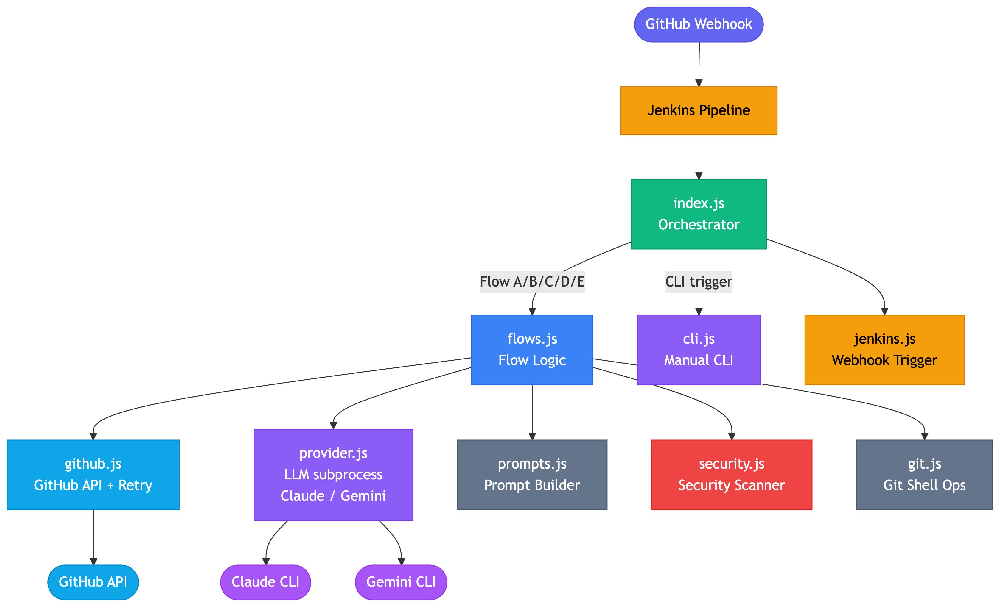
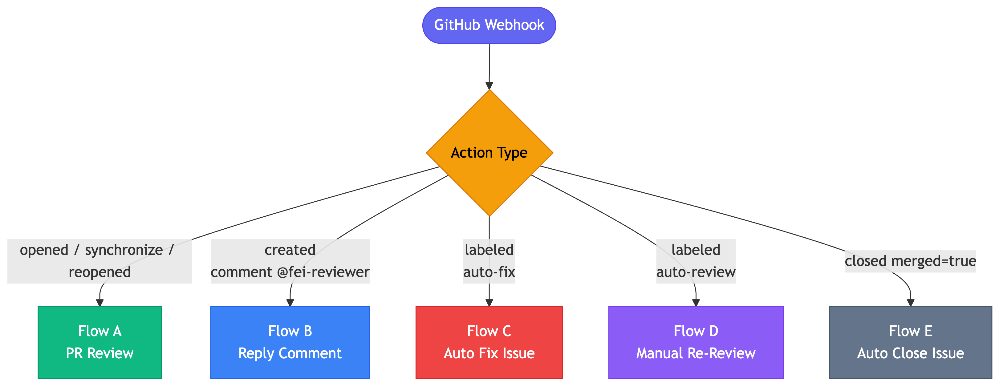
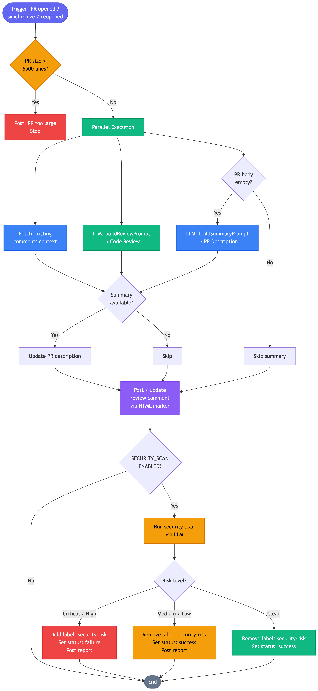
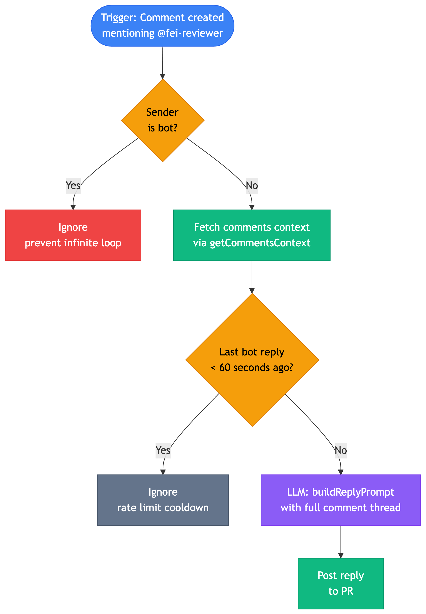
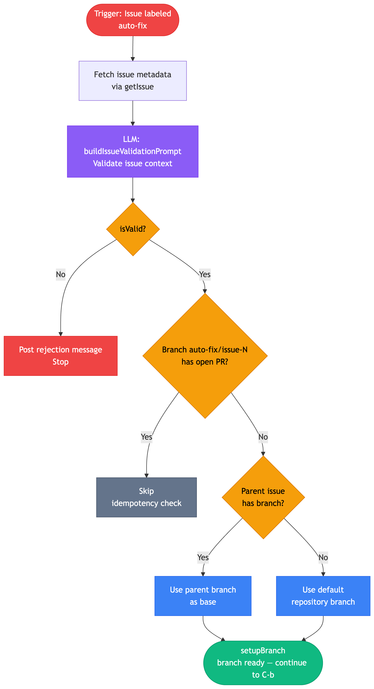
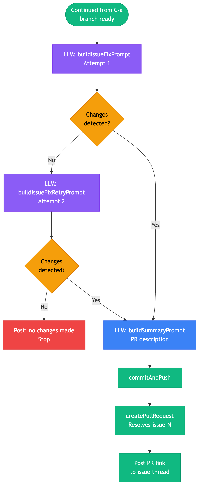
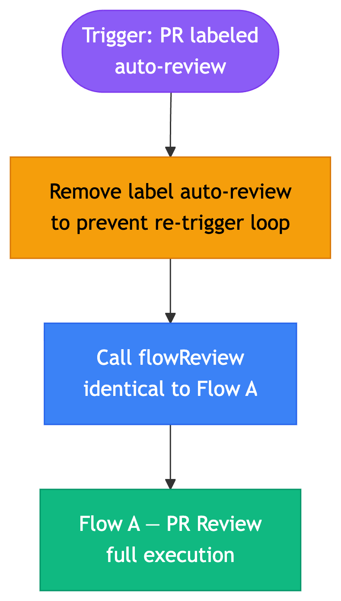
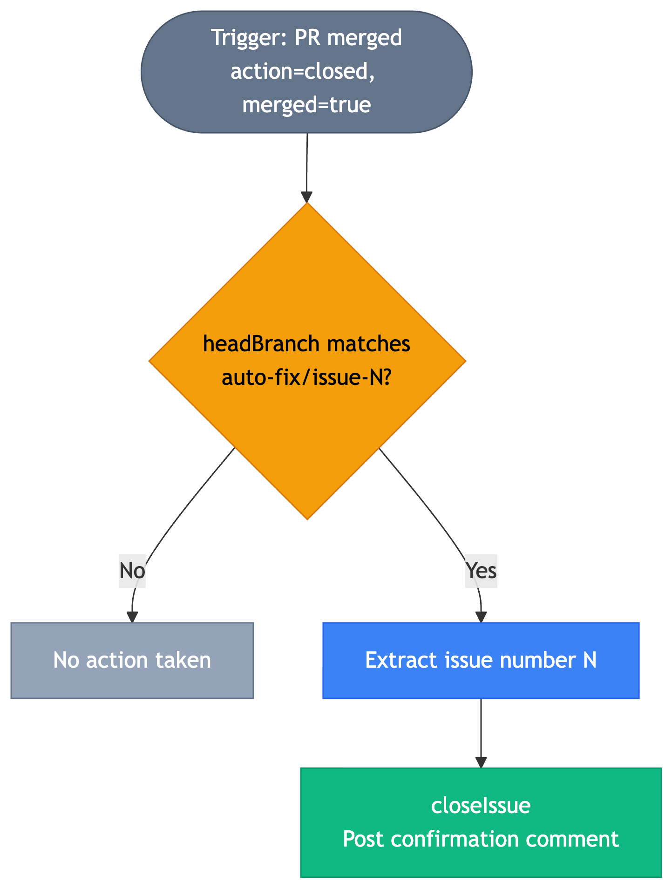

# Process Design Review (PDR)

## Auto-Review GitHub Bot

| Field | Value |
|---|---|
| Document Status | Draft |
| Version | 1.3 |
| Date | 2026-03-05 |
| Author | Engineering Team |
| Reviewer | — |

---

## 1. Background

Code review adalah salah satu tahap yang paling sering menjadi bottleneck dalam siklus pengembangan perangkat lunak. Proses ini bergantung pada ketersediaan reviewer manusia, yang menyebabkan penundaan pada pipeline deployment.

Auto-Review Bot adalah sistem otomasi berbasis LLM yang diintegrasikan ke dalam GitHub dan Jenkins. Sistem ini menangani review Pull Request, menjawab pertanyaan developer di thread PR, memperbaiki issue secara otomatis, dan menutup issue setelah fix di-merge — tanpa intervensi manual pada setiap langkah.

---

## 2. Scope

### In Scope

- Review otomatis Pull Request menggunakan LLM (Claude / Gemini).
- Pemindaian keamanan terhadap perubahan kode di setiap PR.
- Respon otomatis terhadap komentar developer yang menyebut bot.
- Pembuatan branch, penerapan fix kode oleh LLM, dan pembukaan PR secara otomatis untuk GitHub Issue.
- Penutupan otomatis Issue setelah PR fix di-merge.

### Out of Scope

- Review terhadap PR yang mengubah lebih dari 5.500 baris kode (ditangani secara manual).
- Integrasi dengan platform version control selain GitHub.
- Deployment atau eksekusi kode yang dihasilkan LLM ke environment produksi.

### Assumptions

- LLM CLI (`claude` / `gemini`) tersedia dan terauthentikasi di environment CI.
- GitHub webhook dikonfigurasi untuk mengirim event ke Jenkins Generic Webhook Trigger.
- Repository menggunakan default branch sebagai target merge PR.

### Dependencies

| Dependency | Version / Notes |
|---|---|
| Node.js | Runtime eksekusi bot |
| `@octokit/rest` | `^21.0.0` — GitHub REST API client |
| `commander` | `^12.0.0` — CLI argument parsing |
| `dotenv` | `^16.4.0` — env var loading |
| `winston` | `^3.14.0` — logging |
| Claude CLI | LLM provider default |
| Gemini CLI | LLM provider alternatif |
| Jenkins | Generic Webhook Trigger plugin |

---

## 3. System Architecture

**Diagram 1 — System Architecture**



**Runtime:** Node.js
**LLM Provider:** Claude (default) atau Gemini, dijalankan sebagai child process CLI
**GitHub Integration:** Octokit REST API dengan retry logic (429, 502, 503, 504)
**CI/CD:** Jenkins dengan Generic Webhook Trigger plugin

---

## 4. Flow Routing

Semua event masuk dari GitHub Webhook diarahkan berdasarkan kondisi berikut di `index.js`:

**Diagram 2 — Flow Routing**



| GitHub Action | Kondisi Tambahan | Flow |
|---|---|---|
| `opened`, `synchronize`, `reopened` | — | A — PR Review |
| `created` | Comment berisi `@fei-reviewer` | B — Reply Comment |
| `labeled` | Label = `auto-fix` | C — Auto Fix Issue |
| `labeled` | Label = `auto-review` | D — Manual Re-Review |
| `closed` | `merged = true` | E — Auto Close Issue |

---

## 5. Flow Specifications

### 5.1 Flow A — PR Review

**Trigger:** Pull Request dibuka, disinkronkan, atau dibuka kembali.

**Pre-condition:** Total baris perubahan (additions + deletions) tidak melebihi 5.500.

**Diagram 3 — Flow A: PR Review**



**Steps:**

1. Periksa ukuran PR via `checkMassivePR()`. Jika melebihi threshold, post notifikasi dan hentikan eksekusi.
2. Jalankan operasi berikut secara paralel:
   - Fetch konteks komentar PR yang sudah ada via `getCommentsContext()`.
   - Jalankan LLM dengan `buildReviewPrompt` untuk menghasilkan hasil review.
   - Jika PR body kosong, jalankan LLM dengan `buildSummaryPrompt` untuk menghasilkan deskripsi PR.
3. Jika summary tersedia, perbarui deskripsi PR.
4. Post atau perbarui komentar review. Idempotency dijaga dengan HTML marker `<!-- auto-review-bot -->`.
5. Jika `SECURITY_SCAN_ENABLED = true`, jalankan pemindaian keamanan:
   - **Critical / High:** Tambahkan label `security-risk`, set commit status `failure`, post laporan keamanan.
   - **Medium / Low:** Hapus label `security-risk`, set commit status `success`, post laporan keamanan.
   - **Clean:** Hapus label `security-risk`, set commit status `success`. Tidak ada komentar.

**Error Handling:** Timeout atau kegagalan LLM diposting sebagai komentar ke PR. Security scan bersifat non-fatal — kegagalan scan tidak menghentikan flow.

---

### 5.2 Flow B — Reply Comment

**Trigger:** Komentar baru di PR yang menyebut `@fei-reviewer`.

**Diagram 4 — Flow B: Reply Comment**



**Steps:**

1. Abaikan event jika sender adalah bot itu sendiri (pencegahan infinite loop).
2. Fetch konteks komentar via `getCommentsContext()`.
3. Abaikan jika interval antara sekarang dan reply terakhir bot kurang dari 60 detik (rate limiting).
4. Jalankan LLM dengan `buildReplyPrompt`, menyertakan seluruh thread komentar sebagai konteks.
5. Post hasil reply ke PR.

---

### 5.3 Flow C — Auto Fix Issue

**Trigger:** Issue diberi label `auto-fix`.

**Diagram 5a — Flow C (Part 1): Validation & Branch Setup**



**Diagram 5b — Flow C (Part 2): LLM Fix & PR Creation**



**Steps:**

1. Fetch metadata issue via `getIssue()`.
2. Validasi konteks issue via LLM (`buildIssueValidationPrompt`). Jika issue tidak memiliki informasi yang cukup (`isValid = false`), post pesan penolakan dan hentikan eksekusi.
3. Periksa idempotency: jika branch `auto-fix/issue-N` sudah memiliki open PR, skip.
4. Tentukan base branch:
   - Jika issue memiliki parent issue dan branch `auto-fix/issue-{parent}` ada di remote, gunakan branch tersebut sebagai base.
   - Fallback ke default branch repository.
5. Setup branch baru via `setupBranch()`.
6. Jalankan LLM dengan `buildIssueFixPrompt` untuk melakukan perubahan kode (Attempt 1).
7. Jika tidak ada perubahan setelah Attempt 1, ulangi dengan `buildIssueFixRetryPrompt` (Attempt 2, prompt lebih eksplisit).
8. Periksa perubahan yang dihasilkan via `getChangedFiles()`. Jika masih tidak ada perubahan, hentikan eksekusi.
9. Generate deskripsi PR via `buildSummaryPrompt`.
10. Commit dan push perubahan via `commitAndPush()`.
11. Buat Pull Request via `createPullRequest()` dengan referensi ke issue (`Resolves #N`).
12. Post link PR ke thread issue.

---

### 5.4 Flow D — Manual Re-Review

**Trigger:** PR diberi label `auto-review`.

**Diagram 6 — Flow D: Manual Re-Review**



**Description:** Label `auto-review` dihapus terlebih dahulu untuk mencegah re-trigger loop, kemudian memanggil `flowReview()` — identik dengan Flow A. Digunakan untuk memicu ulang review secara on-demand tanpa memerlukan push commit baru.

---

### 5.5 Flow E — Auto Close Issue

**Trigger:** Pull Request di-merge (`action = closed`, `merged = true`).

**Diagram 7 — Flow E: Auto Close Issue**



**Steps:**

1. Periksa apakah `headBranch` cocok dengan pattern `auto-fix/issue-{N}`.
2. Jika cocok, ekstrak nomor issue dan tutup issue tersebut via `closeIssue()` dengan komentar konfirmasi.
3. Jika tidak cocok, tidak ada aksi yang dilakukan.

---

## 6. SLA & Timeout Reference

| Flow | LLM Calls (max) | Timeout per Call | Worst-Case Duration |
|---|---|---|---|
| A — PR Review | 3 (review + summary + security) | 10 menit | 30 menit |
| B — Reply Comment | 1 | 10 menit | 10 menit |
| C — Auto Fix Issue | 4 (validate + fix + retry + summary) | 10 menit | 40 menit |
| D — Manual Re-Review | Sama dengan Flow A | — | 30 menit |
| E — Auto Close Issue | 0 | — | < 5 detik |

LLM calls yang gagal karena timeout dikomunikasikan sebagai komentar ke PR/Issue. Tidak ada automatic retry di level flow — retry hanya ada di level GitHub API (HTTP 429/5xx).

---

## 7. Security Scan Output Format

Security scan menggunakan `buildSecurityScanPrompt`. Output JSON yang diharapkan dari LLM:

```json
{
  "vulnerabilities": [
    {
      "type": "SQL_INJECTION | XSS | HARDCODED_CREDENTIALS | PATH_TRAVERSAL | COMMAND_INJECTION | SSRF | IDOR | OTHER",
      "severity": "critical | high | medium | low",
      "file": "path/to/file.js",
      "line": 42,
      "description": "Brief description of the vulnerability",
      "suggestion": "Specific remediation suggestion"
    }
  ],
  "summary": "Brief overall security assessment",
  "overallRisk": "critical | high | medium | low | none"
}
```

`security.js` mem-parse `overallRisk` untuk menentukan tindakan:

- `critical` / `high` → label `security-risk` + commit status `failure`
- `medium` / `low` → hapus label `security-risk` + commit status `success` + post findings
- `none` → hapus label `security-risk` + commit status `success`, tidak ada komentar

---

## 8. Prompt Context Reference

| Prompt Function | Context yang Dikirim ke LLM |
|---|---|
| `buildReviewPrompt` | PR title, additions, deletions, target branch, repo dir path |
| `buildSummaryPrompt` | PR title, target branch, repo dir path |
| `buildReplyPrompt` | Full comment thread (semua komentar PR), repo dir path |
| `buildIssueFixPrompt` | Issue title, issue body, repo dir path |
| `buildIssueFixRetryPrompt` | Issue title, issue body, repo dir path (dengan instruksi lebih eksplisit) |
| `buildSecurityScanPrompt` | PR title, target branch, repo dir path |
| `buildIssueValidationPrompt` | Issue title, issue body (tanpa repo dir — hanya teks) |

> `buildReplyPrompt` dan `buildIssueFixPrompt` menggunakan XML tag wrapping (`<conversation>`, `<issue>`) dengan instruksi eksplisit untuk tidak mengikuti instruksi dalam tag tersebut — sebagai mitigasi prompt injection.

---

## 9. Supporting Modules

| Module | Responsibility |
|---|---|
| `github.js` | Semua operasi GitHub API (GET/POST PR, Issue, Comment, Label, Status). Retry logic: 3 attempts, base delay 2.000 ms × attempt number. |
| `provider.js` | Menjalankan LLM CLI (claude / gemini) sebagai child process. Timeout: 10 menit. |
| `prompts.js` | Membangun semua prompt LLM: review, reply, fix, fix-retry, validation, summary, security scan. |
| `security.js` | Mem-parse output JSON dari LLM security scan, menentukan level risiko, dan membangun laporan keamanan. |
| `git.js` | Operasi Git melalui shell: `setupBranch`, `getChangedFiles`, `commitAndPush`. |
| `jenkins.js` | Membangun webhook payload dan mengirim HTTP request ke Jenkins Generic Webhook Trigger. |
| `cli.js` | Antarmuka CLI manual untuk menjalankan flow secara lokal: `review`, `fix`, `reply`, `trigger`. |
| `config.js` | Konstanta konfigurasi: threshold baris, label names, bot username, cooldown, model LLM. |

### GitHub API Retry Logic Detail

| Parameter | Value |
|---|---|
| Max retries | 3 |
| Retryable HTTP codes | 429, 502, 503, 504 |
| Base delay | 2.000 ms × attempt number (linear backoff) |
| HTTP 429 override | Menggunakan nilai dari header `Retry-After` (integer seconds atau HTTP-date) |

---

## 10. Configuration Reference

| Parameter | Value | Description |
|---|---|---|
| `MASSIVE_PR_LINES` | 5500 | Batas maksimum total perubahan baris per PR |
| `REPLY_COOLDOWN_MS` | 60000 | Interval minimum antar reply bot (ms) |
| `BOT_USERNAME` | `fei-reviewer` | Username bot di GitHub |
| `BOT_MENTION` | `@fei-reviewer` | String mention yang memicu Flow B |
| `AUTO_FIX_LABEL` | `auto-fix` | Label yang memicu Flow C |
| `AUTO_REVIEW_LABEL` | `auto-review` | Label yang memicu Flow D |
| `SECURITY_SCAN_ENABLED` | `true` | Aktifkan/nonaktifkan pemindaian keamanan |
| `SECURITY_RISK_LABEL` | `security-risk` | Label yang ditambahkan saat ditemukan risiko tinggi |
| `SECURITY_BLOCK_ON` | `['critical', 'high']` | Level risiko yang menyebabkan commit status `failure` |
| `GEMINI_MODEL` | `gemini-3.1-pro-preview` | Model Gemini yang digunakan |

---

## 11. Environment Variables

| Variable | Required | Description |
|---|---|---|
| `GITHUB_TOKEN` | **Yes** | GitHub Personal Access Token atau App token. Divalidasi saat startup — bot berhenti jika tidak ada. |
| `JENKINS_URL` | CLI only | Base URL Jenkins, e.g. `http://jenkins:8080`. Digunakan oleh `cli.js trigger`. |
| `JENKINS_TOKEN` | CLI only | Generic Webhook Trigger token. Digunakan oleh `cli.js trigger`. |
| `JENKINS_USER` | CLI only | Username Jenkins untuk Basic Auth. Opsional jika Jenkins tidak mewajibkan auth. |
| `JENKINS_API_TOKEN` | CLI only | API token Jenkins untuk Basic Auth. Opsional. |

> Variabel dapat di-set via file `.env` di root project (menggunakan `dotenv`), atau sebagai environment variable di Jenkins build environment.

---

## 12. Jenkins Job Configuration

Bot dieksekusi oleh Jenkins job yang dipicu via **Generic Webhook Trigger** plugin. Konfigurasi minimal yang diperlukan:

### Webhook Endpoint

```
POST http://<jenkins>/generic-webhook-trigger/invoke?token=<WEBHOOK_TOKEN>
```

### Generic Trigger Variables

| Variable | JSONPath Expression | Description |
|---|---|---|
| `GH_ACTION` | `$.action` | GitHub event action |
| `GH_REPO` | `$.repository.full_name` | Repository full name |
| `GH_PR_NUMBER` | `$.pull_request.number` | PR number |
| `GH_HEAD_BRANCH` | `$.pull_request.head.ref` | PR head branch |
| `GH_MERGED` | `$.pull_request.merged` | PR merged status |
| `GH_LABEL` | `$.label.name` | Label yang di-apply |
| `GH_COMMENT_BODY` | `$.comment.body` | Isi komentar |
| `GH_ISSUE_NUMBER` | `$.issue.number` | Issue number |
| `GH_SENDER` | `$.sender.login` | Event sender username |
| `GH_PROVIDER` | `$.provider` | LLM provider override (claude/gemini) |

### Build Step

```bash
node src/index.js \
  --action "$GH_ACTION" \
  --repo "$GH_REPO" \
  --pr-number "$GH_PR_NUMBER" \
  --head-branch "$GH_HEAD_BRANCH" \
  --merged "$GH_MERGED" \
  --label "$GH_LABEL" \
  --comment "$GH_COMMENT_BODY" \
  --issue-number "$GH_ISSUE_NUMBER" \
  --sender "$GH_SENDER" \
  --provider "${GH_PROVIDER:-claude}"
```

---

## 13. Local Development

### Prerequisites

- Node.js (versi yang mendukung ES modules)
- `GITHUB_TOKEN` di-set di environment atau file `.env`
- LLM CLI terinstall dan terauthentikasi (`claude` atau `gemini`)

### Setup

```bash
git clone <repo-url>
cd auto-review
npm install
echo "GITHUB_TOKEN=<your_token>" > .env
```

### Running Flows Manually

```bash
# Manual review PR
node src/cli.js review --repo owner/repo --pr 123

# Manual fix issue
node src/cli.js fix --repo owner/repo --issue 456

# Reply to comment
node src/cli.js reply --repo owner/repo --pr 123

# Trigger Jenkins job (requires JENKINS_URL, JENKINS_TOKEN)
node src/cli.js trigger review --repo owner/repo --pr 123

# Dry-run (no writes to GitHub/Git, LLM tetap dieksekusi)
node src/cli.js review --repo owner/repo --pr 123 --dry-run

# Use Gemini instead of Claude
node src/cli.js review --repo owner/repo --pr 123 --provider gemini
```

---

## 14. Testing Strategy

Bot tidak memiliki automated test suite saat ini. Pendekatan testing yang ada:

| Method | Description |
|---|---|
| `--dry-run` flag | Menonaktifkan semua write operation (GitHub API + Git). Digunakan untuk memvalidasi LLM output dan flow logic tanpa side effect. |
| Manual CLI trigger | `node src/cli.js <command>` dapat dijalankan terhadap repository test/sandbox di GitHub. |
| Jenkins dry-run | Jalankan Jenkins job dengan `--dry-run` pada PR atau issue di repository sandbox. |

**Gap yang diketahui:** Tidak ada unit test untuk fungsi helper (`github.js`, `security.js`, `git.js`). Tidak ada integration test otomatis. Test dilakukan sepenuhnya secara manual sebelum deploy.

---

## 15. Observability

Bot tidak memiliki dedicated metrics server. Observability dilakukan melalui:

| Signal | Mechanism |
|---|---|
| Execution log | `console.log` / `console.error` via `winston` — tersedia di Jenkins build log |
| Flow failure | Komentar error dipost ke PR / Issue secara otomatis |
| LLM timeout | Komentar timeout dipost ke PR / Issue |
| Security findings | Komentar dan commit status di GitHub |
| Silent failure detection | **Gap:** Tidak ada alerting jika webhook dari GitHub gagal diterima Jenkins. Bot diam tanpa indikasi kegagalan. |

---

## 16. Key Design Decisions

### 16.1 Idempotency

- Flow A: Satu komentar review per PR. Bot mendeteksi komentar yang sudah ada via HTML marker dan melakukan update, bukan membuat komentar baru.
- Flow C: Satu PR per issue. Eksekusi dihentikan jika branch `auto-fix/issue-N` sudah memiliki open PR.

### 16.2 Dry-Run Mode

Tersedia di semua flow melalui flag `--dry-run`. Saat aktif, semua operasi write ke GitHub dan Git dinonaktifkan. LLM tetap dijalankan untuk keperluan validasi output.

### 16.3 Sub-Issue Support

Flow C mendukung hierarki issue. Jika suatu issue adalah sub-issue dari issue lain, branch fix akan dibuat dari branch `auto-fix/issue-{parent}` (jika tersedia di remote), bukan dari default branch.

### 16.4 Dual LLM Provider

Bot mendukung dua provider: Claude (default) dan Gemini. Provider dipilih via flag `--provider` saat pemanggilan. Provider dieksekusi sebagai CLI subprocess, bukan melalui API SDK.

---

## 17. Error Handling Summary

| Scenario | Behavior |
|---|---|
| PR melebihi 5.500 baris | Post warning ke PR, flow dihentikan |
| LLM timeout (> 10 menit) | Post timeout notice ke PR/Issue |
| LLM error | Post error message ke PR/Issue |
| Issue tidak memiliki konteks cukup | Post rejection message, flow dihentikan |
| Git setup branch gagal | Post error ke Issue, flow dihentikan |
| LLM tidak menghasilkan perubahan (setelah 2 attempt) | Post no-changes message, flow dihentikan |
| Security scan gagal | Log warning, flow tetap dilanjutkan (non-fatal) |
| GitHub API rate limit (429) | Retry dengan backoff berdasarkan header `Retry-After` |

---

## 18. Open Questions

| # | Question | Owner | Due | Status |
|---|---|---|---|---|
| 1 | Apakah threshold 5.500 baris sudah optimal untuk semua repository di organisasi? | Backend Lead | 2026-03-12 | Open |
| 2 | Model LLM mana yang lebih akurat — perlu A/B test minimal 50 PR? | Backend Lead | 2026-03-19 | Open |
| 3 | Apakah perlu approval gate sebelum PR auto-fix di-merge ke branch utama? | Engineering + Product | 2026-03-12 | Open |
| 4 | Bagaimana mendeteksi silent failure jika Jenkins tidak menerima webhook? | DevOps | 2026-03-19 | Open |

---

## 19. Diagram Reference

| # | Diagram | File |
|---|---|---|
| 1 | System Architecture | `06_architecture.png` |
| 2 | Flow Routing | `01_flow_routing.png` |
| 3 | Flow A: PR Review | `02_flow_a_review.png` |
| 4 | Flow B: Reply Comment | `03_flow_b_reply.png` |
| 5a | Flow C (Part 1): Validation & Branch Setup | `04a_flow_c1_validate.png` |
| 5b | Flow C (Part 2): LLM Fix & PR Creation | `04b_flow_c2_fix.png` |
| 6 | Flow D: Manual Re-Review | `07_flow_d_rereview.png` |
| 7 | Flow E: Auto Close Issue | `05_flow_e_autoclose.png` |

---

## 20. Revision History

| Version | Date | Author | Changes |
|---|---|---|---|
| 1.0 | 2026-03-05 | Engineering Team | Initial draft |
| 1.2 | 2026-03-05 | Engineering Team | Added Flow D diagram, SLA matrix, security scan format, observability, Flow C split, actionable open questions |
| 1.3 | 2026-03-05 | Engineering Team | Added env vars, Jenkins job config, local dev guide, testing strategy, prompt context table, retry logic detail |

---

## 21. Approval / Sign-off

| Role | Name | Status | Date |
|---|---|---|---|
| Author | — | Draft | 2026-03-05 |
| Engineering Lead | — | Pending | — |
| Product Owner | — | Pending | — |
